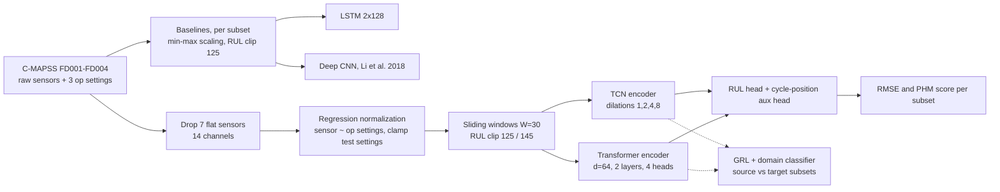

# Turbofan Remaining Useful Life Prediction with TCN, Transformer and Domain Adaptation

A joint project by **Devavrath Sandeep** and **Achintya Gahalaut**: predicting how many cycles a jet engine has left before failure on NASA C-MAPSS. The pipeline starts from per-subset LSTM and Deep CNN baselines, then moves to a Temporal Convolutional Network and a Lightweight Transformer trained jointly on all four subsets with regression-based operating-condition normalization, each with a Gradient Reversal Layer (GRL) domain-adaptation variant.

  


*Transformer self-attention on FD001 test engines. The near-failure engine (true RUL 8, predicted 5.8) concentrates attention on the most recent timesteps; the healthy engine attends more uniformly.*

## What it does

- **Baselines** (`baselines/`): a 2-layer LSTM and a 5-layer 2D Deep CNN (Li et al., 2018), each trained per subset and evaluated on the last window of every test engine. Best FD001 RMSE 13.14 (DCNN); the LSTM is the stronger average (17.79 vs 18.32).
- Trains a **TCN** (26,914 parameters) and a **Lightweight Transformer** (71,074 parameters) jointly on all four C-MAPSS subsets (111,239 windows from 709 engines, window W = 30, 14 sensors).
- The Transformer reaches **test RMSE 14.82 on FD001**, beating the Zheng et al. (2017) LSTM reference of 16.10, and **24.48 on FD002** with no explicit domain adaptation.
- **Regression-based operating-condition normalization** (predict each sensor from the 3 operating settings, subtract, z-score the residual, clamp test settings to the training range) moved FD002 RMSE from a 54-59 plateau in earlier versions to 24-26.
- Adds **GRL variants** (source FD001+FD003, target FD002+FD004, 10-epoch warmup before the Ganin lambda ramp). Negative result: once the base model already sees all four subsets, GRL hurts the multi-condition targets by 15.8 to 31.2 RMSE.
- Interpretability: attention heatmaps, t-SNE of encoder features, per-engine RUL trajectories, and error-by-degradation-stage plots.

## Architecture



The baselines (top branch) are trained separately on each subset. The main models (bottom branch) are trained jointly on all four. Both encoders feed a regression head plus an auxiliary head that predicts normalized cycle position (loss weight 0.3). Training uses an asymmetric MSE that weights late predictions by 1.3x, Adam with cosine annealing, weight decay 1e-4, gradient clipping at 1.0 and early stopping on combined validation RMSE. The GRL variants wrap the same encoders with a gradient reversal layer and a domain classifier (dashed path).

## Quickstart

```bash
git clone https://github.com/DevSoVague/DeepLearning-Dev.git
cd DeepLearning-Dev
python3.10 -m venv .venv && source .venv/bin/activate
pip install -r requirements.txt
# put the C-MAPSS files in ./CMAPSSData (see Data below)
jupyter notebook dev_contri_1_2_final.ipynb
# baselines: run from their own folder so relative paths resolve
cd baselines/lstm && jupyter notebook lstm_multi_v2.ipynb
```

`dev_contri_1_2_final.ipynb` is the final (v12) notebook and keeps its outputs, so you can read the results without running it. Re-running it writes new checkpoints and figures to `./checkpoints_v12/` and `./figures_v12/`. It picks CUDA, then Apple MPS, then CPU. The baseline notebooks (`baselines/lstm/lstm_multi_v2.ipynb`, `baselines/dcnn/final_dcnn_variant.ipynb`) also keep their outputs and load the saved per-subset `.pth` weights in their evaluation cell, so evaluation runs without retraining.

## Data

The notebooks use the **NASA C-MAPSS Turbofan Engine Degradation Simulation** dataset (Saxena et al., 2008). It is not included in this repo.

1. Download it from the NASA Prognostics Center of Excellence data repository (entry 6, "Turbofan Engine Degradation Simulation"): https://www.nasa.gov/intelligent-systems-division/discovery-and-systems-health/pcoe/pcoe-data-set-repository/ , or from the Kaggle mirror: https://www.kaggle.com/datasets/behrad3d/nasa-cmaps
2. Unzip it and place the text files in a folder named `CMAPSSData/` at the repo root:

```
CMAPSSData/
  train_FD001.txt ... train_FD004.txt
  test_FD001.txt  ... test_FD004.txt
  RUL_FD001.txt   ... RUL_FD004.txt
```

Every notebook reads from a `DATA_DIR` variable (default `CMAPSSData` at the repo root, `../../CMAPSSData` from inside `baselines/`); change it if your copy lives elsewhere. `CMAPSSData/` is git-ignored.

## Results

Test RMSE (cycles, lower is better), one prediction per test engine from its last window. PHM score in parentheses where it was computed (asymmetric, lower is better). Main-model rows come from the final v12 run in [`checkpoints/checkpoints_v12/v12_results.json`](checkpoints/checkpoints_v12/v12_results.json); baseline rows come from [`baselines/model_comparison.md`](baselines/model_comparison.md) (the LSTM notebook does not compute the PHM score).

| Model | FD001 | FD002 | FD003 | FD004 |
|---|---|---|---|---|
| LSTM baseline (per subset) | 13.41 | 20.81 | 12.31 | 24.64 |
| Deep CNN baseline (per subset) | 13.14 (311) | 21.04 (4,621) | 11.98 (359) | 27.10 (10,845) |
| TCN | 15.44 (431) | 26.20 (10,813) | 15.56 (502) | 24.72 (5,319) |
| TCN + GRL | 15.64 (441) | 55.44 (420,143) | 16.31 (711) | 55.96 (245,084) |
| Transformer | 14.82 (399) | 24.48 (5,914) | 14.30 (330) | 24.22 (5,146) |
| Transformer + GRL | 14.09 (313) | 41.18 (253,885) | 14.20 (408) | 40.06 (277,850) |
| TCN-GRU (extra encoder in the notebook) | 15.01 (404) | 25.36 (10,661) | 15.32 (442) | 24.06 (3,404) |
| Zheng et al. 2017 (reference) | 16.10 | | | |

The protocols differ, so compare across the two groups with care: the baselines train one model per subset with min-max scaling, RUL clipped at 125 and (for the DCNN) per-subset window sizes of 30/20/30/15, while the main models train one model on all four subsets with regression normalization, W = 30 and RUL clipped at 125 (FD001/FD003) or 145 (FD002/FD004).

Takeaways:

- The per-subset baselines are strong: they score lower RMSE than every jointly trained model on FD001-FD003, and on FD004 the LSTM is within 0.6 RMSE of the best jointly trained model (24.64 vs 24.06). The jointly trained models trade some per-subset accuracy for a single model that covers all four operating regimes.
- Among the jointly trained models, the Transformer is the best overall base model. Transformer + GRL scores best on FD001 (14.09), where it acts as mild regularization, but GRL is clearly harmful on the six-condition subsets FD002 and FD004.
- The Transformer degrades less under GRL than the TCN (-16.7 vs -29.2 RMSE on FD002).


More figures (t-SNE, training curves, GRL dynamics, error buckets, earlier sweeps) are in [`Figures/`](Figures/).

## Project structure

```
.
├── dev_contri_1_2_final.ipynb   # final v12 notebook: TCN, Transformer, TCN-GRU + GRL variants (outputs kept)
├── eda_v1.ipynb                 # exploratory data analysis (outputs cleared)
├── baselines/
│   ├── lstm/                    # LSTM baseline: notebooks, model/preprocessing/train/evaluate scripts, weights
│   ├── dcnn/                    # Deep CNN variant (Li et al., 2018): notebook, weights, notes
│   └── model_comparison.md      # LSTM vs DCNN results and setup
├── model_versions/              # TCN/Transformer iteration history, v1 -> v12
├── checkpoints/
│   ├── checkpoints_v11/         # v11 weights (.pt), training histories, results JSON
│   └── checkpoints_v12/         # final v12 weights, histories, v12_results.json
├── Figures/                     # saved plots per version (figures_v6 ... figures_v12)
├── requirements.txt
└── LICENSE
```

The `model_versions/` notebooks document how the project got here: LSTM baselines (v1, v2), DANN and LSTM-GRL attempts (v4, v5), seed sweeps and MMD (v6, v7), GRU variants (v8, v9, v9.5), multi-subset training (v10), and the v11 normalization bug that v12 fixes (unclamped regression extrapolation overflowing on FD002/FD004 test settings).

## Who built what

Joint project for **Introduction to Deep Learning, Carnegie Mellon University, Spring 2026**, by Devavrath Sandeep and Achintya Gahalaut.

- **Achintya Gahalaut**: LSTM baseline and Deep CNN variant (`baselines/`), originally developed in [AchintyaGahalaut/idl_final_draft2](https://github.com/AchintyaGahalaut/idl_final_draft2).
- **Devavrath Sandeep**: TCN and Lightweight Transformer, their GRL variants, regression-based operating-condition normalization and its v12 fix, and the diagnostic visualizations (`dev_contri_1_2_final.ipynb`, `model_versions/`).

Experimental design, preprocessing decisions and the written report were shared.

References: Saxena et al. 2008 (C-MAPSS); Zheng et al. 2017 (LSTM for RUL); Li et al. 2018 (DCNN for RUL); Bai et al. 2018 (TCN); Ganin et al. 2016 (domain-adversarial training).

## License

MIT, see [LICENSE](LICENSE).
