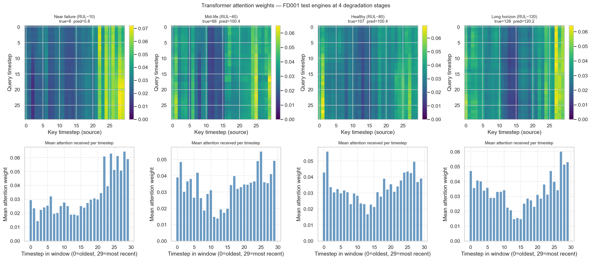
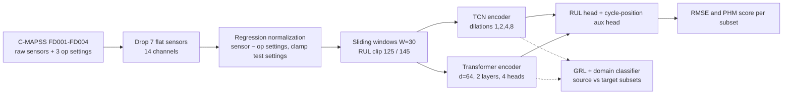
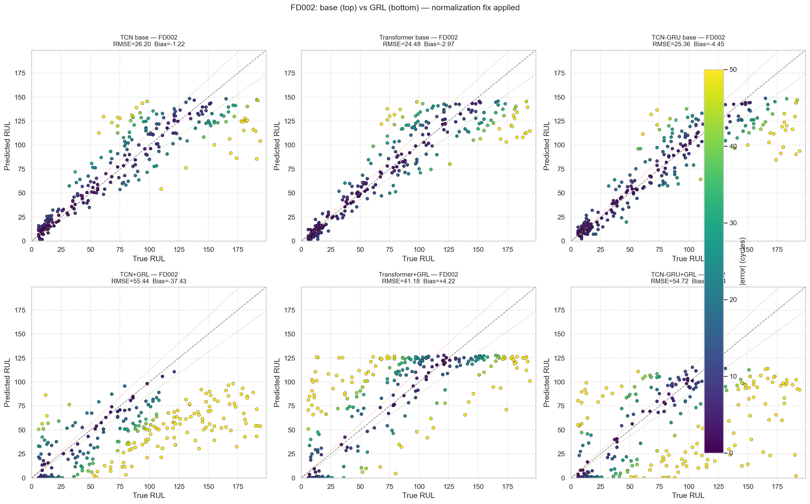
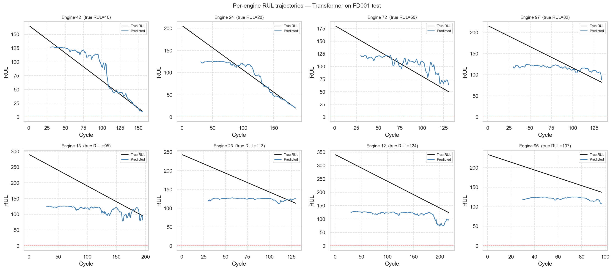

# Turbofan Remaining Useful Life Prediction with TCN, Transformer and Domain Adaptation

Predicting how many cycles a jet engine has left before failure on NASA C-MAPSS, comparing a Temporal Convolutional Network and a Lightweight Transformer, each with a Gradient Reversal Layer (GRL) domain-adaptation variant.

  



*Transformer self-attention on FD001 test engines. The near-failure engine (true RUL 8, predicted 5.8) concentrates attention on the most recent timesteps; the healthy engine attends more uniformly.*

## What it does

- Trains a **TCN** (26,914 parameters) and a **Lightweight Transformer** (71,074 parameters) jointly on all four C-MAPSS subsets (111,239 windows from 709 engines, window W = 30, 14 sensors).
- The Transformer reaches **test RMSE 14.82 on FD001**, beating the Zheng et al. (2017) LSTM reference of 16.10, and **24.48 on FD002** with no explicit domain adaptation.
- **Regression-based operating-condition normalization** (predict each sensor from the 3 operating settings, subtract, z-score the residual, clamp test settings to the training range) moved FD002 RMSE from a 54-59 plateau in earlier versions to 24-26.
- Adds **GRL variants** (source FD001+FD003, target FD002+FD004, 10-epoch warmup before the Ganin lambda ramp). Negative result: once the base model already sees all four subsets, GRL hurts the multi-condition targets by 15.8 to 31.2 RMSE.
- Interpretability: attention heatmaps, t-SNE of encoder features, per-engine RUL trajectories, and error-by-degradation-stage plots.

## Architecture



Both encoders feed a regression head plus an auxiliary head that predicts normalized cycle position (loss weight 0.3). Training uses an asymmetric MSE that weights late predictions by 1.3x, Adam with cosine annealing, weight decay 1e-4, gradient clipping at 1.0 and early stopping on combined validation RMSE. The GRL variants wrap the same encoders with a gradient reversal layer and a domain classifier (dashed path).

## Quickstart

```bash
git clone https://github.com/DevSoVague/DeepLearning-Dev.git
cd DeepLearning-Dev
python3.10 -m venv .venv && source .venv/bin/activate
pip install -r requirements.txt
# put the C-MAPSS files in ./CMAPSSData (see Data below)
jupyter notebook dev_contri_1_2_final.ipynb
```

`dev_contri_1_2_final.ipynb` is the final (v12) notebook and keeps its outputs, so you can read the results without running it. Re-running it writes new checkpoints and figures to `./checkpoints_v12/` and `./figures_v12/`. It picks CUDA, then Apple MPS, then CPU.

## Data

The notebooks use the **NASA C-MAPSS Turbofan Engine Degradation Simulation** dataset (Saxena et al., 2008). It is not included in this repo.

1. Download it from the NASA Prognostics Center of Excellence data repository (entry 6, "Turbofan Engine Degradation Simulation"): https://www.nasa.gov/intelligent-systems-division/discovery-and-systems-health/pcoe/pcoe-data-set-repository/ , or from the Kaggle mirror: https://www.kaggle.com/datasets/behrad3d/nasa-cmaps
2. Unzip it and place the text files in a folder named `CMAPSSData/` at the repo root:

```
CMAPSSData/
  train_FD001.txt ... train_FD004.txt
  test_FD001.txt  ... test_FD004.txt
  RUL_FD001.txt   ... RUL_FD004.txt
```

Every notebook reads from a `DATA_DIR` variable (default `CMAPSSData`); change it if your copy lives elsewhere. `CMAPSSData/` is git-ignored.

## Results

Test RMSE (cycles, lower is better) from the final v12 run, read from [`checkpoints/checkpoints_v12/v12_results.json`](checkpoints/checkpoints_v12/v12_results.json). PHM score in parentheses (asymmetric, lower is better).

| Model | FD001 | FD002 | FD003 | FD004 |
|---|---|---|---|---|
| TCN | 15.44 (431) | 26.20 (10,813) | 15.56 (502) | 24.72 (5,319) |
| TCN + GRL | 15.64 (441) | 55.44 (420,143) | 16.31 (711) | 55.96 (245,084) |
| **Transformer** | **14.82 (399)** | **24.48 (5,914)** | **14.30 (330)** | 24.22 (5,146) |
| Transformer + GRL | 14.09 (313) | 41.18 (253,885) | 14.20 (408) | 40.06 (277,850) |
| TCN-GRU (extra encoder in the notebook) | 15.01 (404) | 25.36 (10,661) | 15.32 (442) | 24.06 (3,404) |
| Zheng et al. 2017 (reference) | 16.10 | | | |

Takeaways:

- The Transformer is the best overall base model. Transformer + GRL scores best on FD001 (14.09), where it acts as mild regularization, but GRL is clearly harmful on the six-condition subsets FD002 and FD004.
- The Transformer degrades less under GRL than the TCN (-16.7 vs -29.2 RMSE on FD002).
- For context, the teammate's LSTM baseline and Deep CNN (separate repo, see Team) reached FD001 RMSE 13.41 and 13.14 under their own single-subset setup and evaluation protocol, so those numbers are not directly comparable to the jointly trained models above.





More figures (t-SNE, training curves, GRL dynamics, error buckets, earlier sweeps) are in [`Figures/`](Figures/).

## Project structure

```
.
├── dev_contri_1_2_final.ipynb   # final v12 notebook: TCN, Transformer, TCN-GRU + GRL variants (outputs kept)
├── eda_v1.ipynb                 # exploratory data analysis (outputs cleared)
├── model_versions/              # iteration history, v1 LSTM baseline -> v12
├── checkpoints/
│   ├── checkpoints_v11/         # v11 weights (.pt), training histories, results JSON
│   └── checkpoints_v12/         # final v12 weights, histories, v12_results.json
├── Figures/                     # saved plots per version (figures_v6 ... figures_v12)
├── requirements.txt
└── LICENSE
```

The `model_versions/` notebooks document how the project got here: LSTM baselines (v1, v2), DANN and LSTM-GRL attempts (v4, v5), seed sweeps and MMD (v6, v7), GRU variants (v8, v9, v9.5), multi-subset training (v10), and the v11 normalization bug that v12 fixes (unclamped regression extrapolation overflowing on FD002/FD004 test settings).

## Team & credits

Course project for **CMU Introduction to Deep Learning, Spring 2026**, two-person team:

- **Devavrath Sandeep** (this repo): Contributions 1 and 2, the TCN and Lightweight Transformer with their GRL variants, regression-based operating-condition normalization and its v12 fix, and all six diagnostic visualizations in the final notebook.
- **Achintya Gahalaut**: the LSTM baseline and the Deep CNN variant (Li et al., 2018), in [AchintyaGahalaut/idl_final_draft2](https://github.com/AchintyaGahalaut/idl_final_draft2).

Experimental design, preprocessing decisions and the written report were collaborative.

References: Saxena et al. 2008 (C-MAPSS); Zheng et al. 2017 (LSTM for RUL); Li et al. 2018 (DCNN for RUL); Bai et al. 2018 (TCN); Ganin et al. 2016 (domain-adversarial training).

## License

MIT, see [LICENSE](LICENSE).
